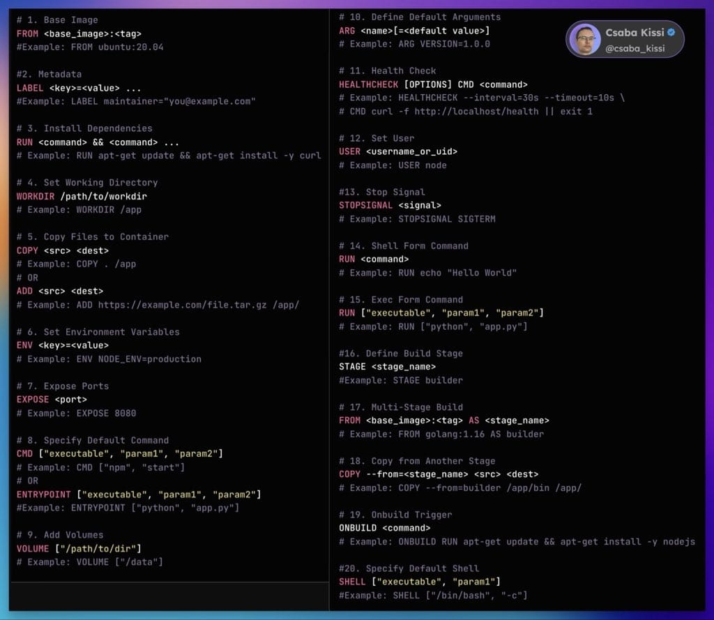

# Docker

## What is Docker?

Docker is a platform for developing, packaging, and running applications in containers.
Without Docker → You install your app, dependencies, and configurations directly on your computer or server. This can cause _"works on my machine"_ problems.

With Docker → You package everything the app needs (code, runtime, libraries, environment variables, etc.) into a lightweight, portable container. You can run that container anywhere — no need to reconfigure.

***

## Key Concepts
### Image
A blueprint for a container.
Contains your application code + all the dependencies + environment configuration.
Created from a **Dockerfile** (a script with instructions for building the image).
Example: python:3.11, nginx:latest.

### Container
A running instance of an image.
You can have multiple containers from the same image, each isolated.
Containers are ephemeral — they can be stopped, deleted, or replaced quickly.

### Dockerfile 
A text file with instructions for building an image. Defines how to build an image.Think of it as a recipe: it lists instructions to create the environment (install dependencies, copy code, set configs).It is used for creating a Docker image.

Example: 
```
# Dockerfile
FROM node:20
WORKDIR /app
COPY package.json .
RUN npm install
COPY . .
CMD ["npm", "start"]
```

### Docker-compose.yml
Defines how to run one or more containers together.Think of it as the dinner menu & serving plan: it specifies what containers to run, their environment variables, networks, volumes, and dependencies.It is used for Running multiple services (like app + database) with one command.

Example:

```version: "3.8"
services:
  app:
    build: .
    ports:
      - "3000:3000"
    depends_on:
      - db
  db:
    image: mysql:8
    environment:
      MYSQL_ROOT_PASSWORD: root
      MYSQL_DATABASE: mydb
    ports:
      - "3306:3306"
```

### Docker Hub
A public (or private) registry where Docker images are stored and shared.
Like GitHub for code, but for container images.

### Volumes
A way to persist data outside the container.
Because containers are disposable, volumes let you keep things like databases between restarts.

### Networks
Containers can communicate with each other over Docker networks.
Useful in microservices setups (e.g., web service container talking to a database container).

### Layers 
Every instruction in a Dockerfile creates a layer. Layers are cached so rebuilds are faster.

### Base Image
The starting point (e.g., python:3.12, golang:1.21-alpine, or ubuntu:22.04)

### Build Context 
The directory you run docker build from. All files inside are available to the Docker build.

### Caching 
If nothing changes in a layer, Docker uses the cached version to speed up builds.

### Small Image Size 
Use minimal images (e.g., alpine) to reduce size and security risks.

## Writing a Dockerfile

A Dockerfile is simply a text file containing a set of instructions for building a Docker image.
You tell Docker:

* Which base OS or base image to start from
* Which files to copy in
* Which dependencies to install
* Which commands to run
* Which ports to expose
* What command to execute when the container starts

###  Common Dockerfile Instructions

| Instruction     | Purpose                                                     | Example                                         |
| --------------- | ----------------------------------------------------------- | ----------------------------------------------- |
| `FROM`          | Set base image                                              | `FROM node:20-alpine`                           |
| `WORKDIR`       | Set working directory                                       | `WORKDIR /app`                                  |
| `COPY`          | Copy files from host to image                               | `COPY . /app`                                   |
| `ADD`           | Like `COPY` but can also extract archives and download URLs | `ADD app.tar.gz /app`                           |
| `RUN`           | Execute commands in the image during build                  | `RUN apt-get update && apt-get install -y curl` |
| `ENV`           | Set environment variables                                   | `ENV PORT=8080`                                 |
| `EXPOSE`        | Declare the port the app listens on                         | `EXPOSE 8080`                                   |
| `CMD`           | Default command when container starts                       | `CMD ["node", "server.js"]`                     |
| `ENTRYPOINT`    | Similar to CMD but always runs first                        | `ENTRYPOINT ["python"]`                         |
| `ARG`           | Pass build-time variables                                   | `ARG NODE_VERSION=20`                           |
| `.dockerignore` | File to exclude files from build                            | `node_modules`                                  |



### Best Practices
* Minimize layers – Combine `RUN` commands with &&
* Use .dockerignore – Prevent copying unnecessary files (like node_modules)
* Pin versions – Avoid "latest" for reproducibility
* Use multi-stage builds – Compile in one stage, copy only final output into a smaller image
* Keep images small – Use Alpine or slim versions
* Separate config from code – Use `ENV` or bind mounts


###  The Dockerfile Build Process

`docker build -t myimage .` OR `docker build -t myimage:1.0 .`

`myimage` is the name of the image.
`tag` is a label for that image version (e.g., `v1.0`, `latest`, `dev`).
The `.` means “build using the Dockerfile in the current directory.”

**Tagging** is optional, but important for versioning.
Without a tag, it defaults to `:latest`, which can get confusing when managing multiple builds.


## Basic Commands

| Command                                      | Description                                                  |                                             
| -------------------------------------------- | ------------------------------------------------------------ | 
| `docker --version`                           | Show Docker version                                          |                                             
| `docker info`                                | Display system-wide information about Docker                 |                                             
| `docker help`                                | Show help for Docker commands                                |                                             
| `docker pull <image>`                        | Download an image from a registry (e.g., Docker Hub)         |                                             
| `docker images`                              | List all downloaded images                                   |                                             
| `docker rmi <image>`                         | Remove one or more images                                    |                                             
| `docker run <image>`                         | Create and start a container from an image                   |                                             
| `docker run -it <image> /bin/bash`           | Run a container interactively with a shell                   |                                             
| `docker ps`                                  | List running containers                                      |                                             
| `docker ps -a`                               | List all containers (running and stopped)                    |                                             
| `docker stop <container>`                    | Stop a running container                                     |                                             
| `docker kill <container>`                    | Immediately stop a container                                 |                                             
| `docker start <container>`                   | Start a stopped container                                    |                                             
| `docker restart <container>`                 | Restart a container                                          |                                             
| `docker rm <container>`                      | Remove one or more stopped containers                        |                                             
| `docker logs <container>`                    | Show logs of a container                                     |                                             
| `docker exec -it <container> <command>`      | Run a command inside a running container (e.g., `/bin/bash`) |                                             
| `docker inspect <container image>`           | Show detailed info about container or image                  |
| `docker commit <container> <new_image_name>` | Create a new image from a container's changes                |                                             
| `docker tag <image> <repo>:<tag>`            | Tag an image for pushing or organizing                       |                                             
| `docker push <repo>:<tag>`                   | Push an image to a registry                                  |                                             
| `docker build -t <image_name> .`             | Build an image from a Dockerfile in the current directory    |                                             
| `docker volume ls`                           | List all Docker volumes                                      |                                             
| `docker volume create <name>`                | Create a new volume                                          |                                             
| `docker volume rm <name>`                    | Remove a volume                                              |                                             
| `docker network ls`                          | List Docker networks                                         |                                             
| `docker network create <name>`               | Create a new Docker network                                  |                                             
| `docker network rm <name>`                   | Remove a Docker network                                      |                                             
| `docker stats`                               | Show live resource usage stats of containers                 |                                             
| `docker system prune`                        | Remove unused data (containers, images, volumes, networks)   |                                             
| `docker attach <container>`                  | Attach your terminal to a running container                  |                                             
| `docker save -o <file.tar> <image>`          | Save an image to a tarball file                              |                                             
| `docker load -i <file.tar>`                  | Load an image from a tarball file                            |                                             


## Docker Data Persistence 

### Data Persistence in Docker
**Why Persistence?**
Containers are ephemeral by default — when a container is removed, its data is lost. Persistence means saving data outside the container lifecycle.
**Methods of Persistence**
#### Volumes (recommended)
Managed by Docker. Stored in Docker’s storage area (`/var/lib/docker/volumes/`) by default. Survive container removal, Can be shared between containers

Created by running `docker volume create myvolume`
To use in a container `docker run -v myvolume:/data myimage`

#### Bind mounts
Mounts a directory/file from the host filesystem into the container
Syntax: `docker run -v /host/path:/container/path myimage`
Good for local development and debugging
Changes on either side reflect immediately

#### tmpfs mounts (in-memory, temporary)
Data stored in RAM, not persisted on disk
Used for sensitive or temporary data


| Feature           | Volumes                          | Bind Mounts                  |
| ----------------- | -------------------------------- | ---------------------------- |
| Managed by Docker | Yes                              | No                           |
| Location          | Docker area (`/var/lib/docker/`) | Any path on host             |
| Portability       | Yes (can be moved/shared)        | No (host-specific)           |
| Performance       | Slightly better                  | Depends on host filesystem   |
| Use cases         | Production, backups, sharing     | Development, local debugging |


## Networking in Docker
### Docker Networks
By default, Docker creates a few networks:
* bridge (default)
* host
* none

**Common Network Types**
Bridge network (default) => Containers on same bridge network can communicate by container name
Isolated from external network unless ports are published

**Host network**
Container shares host network stack directly. No network isolation, faster network performance

**Overlay network** (for multi-host communication, mainly in Swarm/K8s)


### Networking Commands

| Command                                           | Description                                    |
| ------------------------------------------------- | ---------------------------------------------- |
| `docker network ls`                               | List all Docker networks                       |
| `docker network inspect <network_name>`           | Show detailed info about a specific network    |
| `docker network create <network_name>`            | Create a new user-defined network              |
| `docker network rm <network_name>`                | Remove/delete a user-defined network           |
| `docker network connect <network> <container>`    | Connect a running container to a network       |
| `docker network disconnect <network> <container>` | Disconnect a container from a network          |
| `docker run --network <network_name> <image>`     | Run a container attached to a specific network |
| `docker network prune`                            | Remove all unused networks                     |


### Exposing and Publishing Ports
By default, containers are isolated. To access services inside a container from the host or outside, you publish ports: `docker run -p <host_port>:<container_port> myimage`
Example: Serve a web app on port 80 inside the container, expose to port 8080 on the host: `docker run -p 8080:80 nginx`
You can also publish ranges: `docker run -p 5000-5010:5000-5010 myapp`


## Docker Compose — Multi-Container Orchestration

### What is Docker Compose?
A tool for defining and running multi-container Docker applications.
Use a YAML file (`docker-compose.yml`) to configure your app’s services, networks, and volumes.
Simplifies managing multiple containers that work together (e.g., web app + database).
Run with a single command: `docker-compose up`

### Key Docker Compose Concepts
* **services**: Each containerized component.
* **build**: Build an image from a Dockerfile directory.
* **image**: Use an existing image from Docker Hub or other registry.
* **ports**: Map container ports to host ports.
* **volumes**: Mount host directories or Docker volumes.
* **environment**: Pass environment variables to containers.
* **depends_on**: Define service startup order (only waits for container start, not health).
* **networks**: Control container networking (default is a single network).

### Usefull Commands

| Command                               | Description                                                   |
| ------------------------------------- | ------------------------------------------------------------- |
| `docker-compose up`                   | Create and start all services defined in `docker-compose.yml` |
| `docker-compose up -d`                | Run containers in detached mode (background)                  |
| `docker-compose down`                 | Stop and remove containers, networks, volumes created by `up` |
| `docker-compose ps`                   | List running containers/services                              |
| `docker-compose logs`                 | View logs of all services                                     |
| `docker-compose logs <service>`       | View logs for a specific service                              |
| `docker-compose build`                | Build or rebuild images                                       |
| `docker-compose stop`                 | Stop running services                                         |
| `docker-compose restart`              | Restart services                                              |
| `docker-compose exec <service> <cmd>` | Run command inside a running service container                |


### Environment Variables in Compose
Use .env file to store environment variables.
Variables can be referenced in `docker-compose.yml` using `${VAR_NAME}` syntax.
Helps to avoid hardcoding sensitive data like passwords or ports.


### Scaling Services
You can run multiple instances of a service with: `docker-compose up --scale service=3`

### Best Practices
Keep services small and focused (one process per container).
Use volumes for data persistence.
Avoid using `depends_on` for critical service readiness — use healthchecks instead.
Keep `docker-compose.yml` in your project root for easy version control.
Use `.env` files or external secrets managers for sensitive info.

**docker-compose.yml** file example
```
version: '3.8'

services:
  web:
    build: ./webapp           # Path to your app's Dockerfile
    ports:
      - "3000:3000"          # Map host port 3000 to container port 3000
    environment:
      - DATABASE_URL=postgres://user:password@db:5432/mydatabase
    depends_on:
      - db
    volumes:
      - ./webapp:/usr/src/app # Bind mount source code for live editing (optional)

  db:
    image: postgres:14       # Use official PostgreSQL image
    restart: always
    environment:
      POSTGRES_USER: user
      POSTGRES_PASSWORD: password
      POSTGRES_DB: mydatabase
    volumes:
      - pgdata:/var/lib/postgresql/data

volumes:
  pgdata:
```

**Explanation:**
* **version:** Compose file format version.
* **services:** Defines the containers — `web` (your app) and `db` (PostgreSQL).
* **build:** Path to your Dockerfile to build your app image.
* **ports:** Exposes container ports to your host machine.
* **environment:** Environment variables inside the container.
* **depends_on:** Ensures `db` starts before `web`.
* **volumes:**
    * For `web` service: mounts your local app code inside container (optional, helpful during development).
    * For `db`: persists database data on your host with a Docker volume named `pgdata`.

